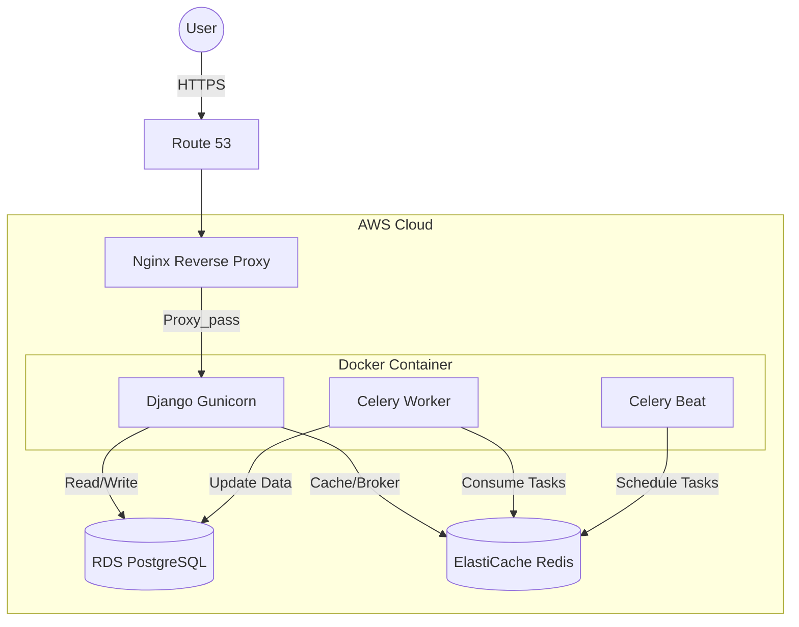

# 🐾 PetCare - Pet Shop Management System

[](https://github.com/CFBruna/petcare_project/actions/workflows/ci.yml)
[]()
[](https://www.python.org/downloads/)
[](https://docs.djangoproject.com/)
[](https://opensource.org/licenses/MIT)

> Enterprise-grade web application for pet shop management, built with best practices, robust architecture, and production-ready infrastructure on AWS.

**🚀 Live Demo:** [petcare.brunadev.com](http://petcare.brunadev.com) | **📚 API Docs:** [Swagger UI](http://petcare.brunadev.com/api/v1/schema/swagger-ui/)

---

## 📸 Screenshots

### Landing Page


*Modern landing page with demo credentials and clean UX/UI design.*

---

### Dashboard Analytics


*Revenue metrics, daily appointments, and 7-day billing chart with real-time data.*

---

### API Documentation (Swagger UI)


*RESTful API with 15+ endpoints documented following OpenAPI 3.0 specification.*

---

## 🎯 Quick Start

Test the live application deployed on AWS production infrastructure:

### 🔐 Demo Credentials

**Email:** recrutador@petcare.com
**Password:** avaliar123

**Access Points:**
- 🌐 Main Application: [petcare.brunadev.com](http://petcare.brunadev.com)
- 🛠️ Admin Panel: [petcare.brunadev.com/admin](http://petcare.brunadev.com/admin)
- 📖 API Documentation: [Swagger UI](http://petcare.brunadev.com/api/v1/schema/swagger-ui/) | [ReDoc](http://petcare.brunadev.com/api/v1/schema/redoc/)

---

## 🏭️ Production Architecture (AWS)

This project runs on a modern, scalable cloud infrastructure:

**Infrastructure Components:**
- **Compute:** EC2 instance running containerized application (Docker)
- **Database:** RDS PostgreSQL for reliable, managed data storage
- **Cache & Queue:** ElastiCache Redis for Celery task queue and caching
- **Web Server:** Nginx as reverse proxy and static file server
- **DNS:** Route 53 for domain management
- **Containerization:** Docker & Docker Compose for environment consistency



---

## ✨ Key Features

### � Smart Scheduling System
- **Automatic Availability Calculation:** Time slots calculated based on service duration and operating hours (8 AM - 8 PM)
- **Status Workflow:** Track appointments through lifecycle: Pending → Confirmed → Completed/Canceled
- **Service Management:** Configure specific durations and pricing for each service type
- **Conflict Prevention:** Real-time validation prevents double-booking

### 📦 Advanced Store & Inventory Management
- **Batch Tracking:** Products managed by **Lots** (`ProductLot`) with individual expiration dates and quantities
- **Dynamic Pricing Engine:**
  - **Manual Promotions:** Date-range based discounts on specific product lots
  - **Automatic Expiration Discounts:** Background tasks apply progressive discounts (30% < 7 days, 20% < 15 days, 10% < 30 days) to reduce waste
  - **Best Price Logic:** POS automatically applies lowest price between manual promotion vs. auto-discount
- **Sales Processing:** Point-of-sale interface with real-time inventory updates

### 🩺 Health & Pet Registry
- **Multi-Species Support:** Detailed profiles for Dogs, Cats, Birds, and more
- **Health Records:** Track vaccines, surgeries, consultations with "Next Due Date" reminders
- **Complete History:** Comprehensive medical timeline for each pet

### 📊 Dashboard & Analytics
- **Real-Time Metrics:** Daily revenue, confirmed appointments, and 7-day billing charts
- **Automated Reports:** Daily email summaries for sales, appointments, and promotions (Celery)
- **Data Visualization:** Interactive charts for revenue trends

### 🛡️ Technical Highlights
- **94% Test Coverage** with pytest + factory-boy
- **CI/CD Pipeline** with GitHub Actions (lint, type-check, security scan, test)
- **Service Layer Architecture** for clean separation of concerns
- **Production-Ready Factories** for data seeding, testing, and Celery tasks
- **Structured Logging** with structlog for JSON-formatted production observability
- **OpenAPI Documentation** with drf-spectacular (Swagger/ReDoc)
- **Asynchronous Tasks** with Celery + Redis + django-celery-beat
- **Type Safety** with MyPy strict mode
- **Code Quality** enforced by Ruff + pre-commit hooks
- **Modern Dependency Management** with uv (10-100x faster than pip)

---

## 🛠️ Tech Stack

**Backend**
- Python 3.12
- Django 5.2
- Django REST Framework 3.16
- Celery 5.4 (task queue)
- Gunicorn (WSGI server)

**Database & Cache**
- PostgreSQL 16
- Redis 7 (Celery broker + cache)

**Infrastructure**
- Docker + Docker Compose
- Nginx (reverse proxy)
- AWS EC2, RDS, ElastiCache, Route 53

**Code Quality & Testing**
- pytest + pytest-django
- factory-boy (test fixtures - **production-ready**)
- Ruff (linting)
- MyPy (type checking)
- Bandit (security scanning)
- Safety (dependency vulnerability checks)
- pre-commit hooks

**API Documentation**
- drf-spectacular (OpenAPI 3.0)

**Dependency Management**
- uv (Astral's blazing-fast Python package manager)

---

## 🚀 Local Development Setup

### Prerequisites
- [Docker Desktop](https://www.docker.com/products/docker-desktop/)
- [Git](https://git-scm.com/)

### Installation Steps

1. **Clone the repository**

```bash
git clone https://github.com/CFBruna/petcare_project.git
cd petcare_project
```

2. **Set up environment variables**

```bash
cp .env.example .env
```

> 💡 **Tip:** The default values in `.env.example` work out-of-the-box for local Docker development. Only edit if you need custom configuration.

3. **Build and start containers**

```bash
docker compose up --build -d
```

4. **Run database migrations**

```bash
docker compose exec web python manage.py migrate
```

5. **Create superuser**

```bash
docker compose exec web python manage.py createsuperuser
```

6. **Load sample data (optional)**

```bash
docker compose exec web python manage.py seed_db
```

7. **Access the application**
- Admin Panel: `http://127.0.0.1:8000/admin/`
- API Docs: `http://127.0.0.1:8000/api/v1/schema/swagger-ui/`

### 📊 Running the Analytics Dashboard (Frontend)

The analytics dashboard is a separate TypeScript frontend that consumes the Django API.

```bash
# Install Node.js dependencies
cd frontend
npm install

# Run development server (with hot reload)
npm run dev

# Access dashboard
# http://localhost:5173
```

The Vite dev server automatically proxies API requests to Django backend (`localhost:8000`).

**For Production Build:**
```bash
# Build frontend to Django static
./scripts/build-frontend.sh

# Output: src/static/dashboard/
```

---

## 🧪 Running Tests

Execute the complete test suite with coverage report:

```bash
docker compose exec web pytest --cov
```

With detailed output:

```bash
docker compose exec web pytest --cov --cov-report=html -v
```

Run specific test file:

```bash
docker compose exec web pytest src/apps/pets/tests/test_models.py -v
```

**Coverage Report:** The project maintains **94% test coverage** across all modules.

---

## 📚 API Documentation

The API follows OpenAPI 3.0 specification and provides interactive documentation:

**Local Development:**
- Swagger UI: `http://127.0.0.1:8000/api/v1/schema/swagger-ui/`
- ReDoc: `http://127.0.0.1:8000/api/v1/schema/redoc/`

**Production:**
- Swagger UI: `http://petcare.brunadev.com/api/v1/schema/swagger-ui/`
- ReDoc: `http://petcare.brunadev.com/api/v1/schema/redoc/`

### API Endpoints Overview

| Resource | Endpoint | Methods | Description |
|----------|----------|---------|-------------|
| Customers | `/api/v1/customers/` | GET, POST, PUT, DELETE | Manage pet owners |
| Pets | `/api/v1/pets/` | GET, POST, PUT, DELETE | Manage registered pets |
| Appointments | `/api/v1/appointments/` | GET, POST, PUT, DELETE | Schedule services |
| Products | `/api/v1/products/` | GET, POST, PUT, DELETE | Manage inventory |
| Sales | `/api/v1/sales/` | GET, POST | Process transactions |

---

---

## ⚙️ Background Tasks (Celery)

The system uses Celery Beat for automated scheduled tasks. All tasks are configured with `America/Sao_Paulo` timezone:

| Task | Schedule | Description |
|------|----------|-------------|
| `simulate_daily_activity` | **02:00 AM BRT** | Generates realistic demo data (customers, sales, appointments) to keep the demo environment active |
| `generate_daily_sales_report` | **01:05 AM BRT** | Emails daily sales summary to admin with revenue metrics |
| `generate_daily_promotions_report` | **01:10 AM BRT** | Reports active promotions and promotional stock levels |
| `apply_expiration_discounts` | **01:30 AM BRT** | **Business Rule:- **Scheduled Discounts:** Expired products don't sit—they auto-discount:<br>• **30 days before** expiration: 10%<br>• **15 days before**: 20%<br>• **7 days before**: 30% |

### 📊 Analytics Dashboard (TypeScript)
- **Interactive Dashboard:** Real-time business metrics visualization
- **TypeScript + React:** Modern frontend with strict type safety
- **Recharts Integration:** Professional charts for revenue and appointments trends
- **Responsive Design:** Tailwind CSS with mobile-first approach
- **API Integration:** Type-safe Axios service consuming Django REST endpoints
- **Period Filtering:** Dynamic data for 7/30/90 days
- **Portuguese UI:** Localized interface for Brazilian market

### Manual Task Execution

Trigger the data simulation manually for testing:

```bash
docker compose exec web python manage.py shell -c "
from src.apps.store.tasks import simulate_daily_activity
result = simulate_daily_activity()
print(result)
"
```

**Expected Output:**
```
2025-12-07T05:00:00.502290Z [info] simulate_daily_activity_started
Time slots (Mon-Fri, 08h-20h) ensured.
Created 5 new customers.
Created product 'Ração Premium para Cães Adultos 15kg' with 2 lots.
Created product 'Shampoo Antipulgas e Carrapatos 500ml' with 2 lots.
Created product 'Petisco Natural de Frango Desidratado 200g' with 2 lots.
Created 5 sales for yesterday.
Created 7 appointments.
Created 4 health records.
Created 2 manual promotions.
Triggered automatic expiration discounts task.
```

---

## 🔄 CI/CD Pipeline

Every push or pull request to `main` triggers an automated pipeline:

1. 📦 Install Dependencies (uv)
2. 🔍 Type Check (MyPy)
3. ✨ Lint Code (Ruff)
4. 🛡️ Security Scan (Bandit + Safety)
5. 🧪 Run Tests (pytest) + Coverage Report
6. ✅ Quality Gate: 90%+ coverage required

View workflow: [.github/workflows/ci.yml](.github/workflows/ci.yml)

---

## 📁 Project Structure

```
petcare_project/
├── src/
│   ├── apps/
│   │   ├── accounts/
│   │   │   ├── factories.py         # ✨ Production-ready factories
│   │   │   ├── models.py
│   │   │   ├── services.py
│   │   │   ├── api/
│   │   │   └── tests/
│   │   ├── pets/                    # Pet registration
│   │   │   ├── factories.py         # ✨ Production factories
│   │   │   └── ...
│   │   ├── health/                  # Health records
│   │   │   ├── factories.py         # ✨ Production factories
│   │   │   └── ...
│   │   ├── schedule/                # Appointment system
│   │   │   ├── factories.py         # ✨ Production factories
│   │   │   ├── services.py
│   │   │   └── ...
│   │   ├── store/                   # Products, sales, promotions
│   │   │   ├── factories.py         # ✨ Production factories
│   │   │   ├── tasks.py             # ✨ Celery tasks with logging
│   │   │   ├── services.py
│   │   │   └── ...
│   │   └── core/                    # Shared utilities
│   │       └── management/commands/
│   │           └── seed_db.py       # Database seeding
│   ├── petcare/
│   │   ├── settings.py              # Django settings
│   │   ├── urls.py                  # Main URL configuration
│   │   └── celery.py                # Celery config
│   └── conftest.py                  # Pytest fixtures
├── .github/workflows/               # CI/CD pipelines
│   └── ci.yml
├── docker-compose.yml               # Local development
├── docker-compose.prod.yml          # Production config
├── Dockerfile                       # Container definition
├── pyproject.toml                   # uv dependencies
├── uv.lock                          # Locked dependencies
└── pytest.ini                       # Test configuration
```

**Key Architecture Decisions:**
- ✨ **Factories in Production:** Factory classes live outside `tests/` directories, enabling use in management commands, Celery tasks, and seeding scripts
- 🏗️ **Service Layer:** All business logic isolated in `services.py`, keeping models thin and views clean
- 📊 **Structured Logging:** All Celery tasks use `structlog` for JSON-formatted logs with full observability

---

## 🌟 Key Learnings & Highlights

This project demonstrates proficiency in:

- ✅ **Clean Architecture:** Service Layer + Repository Pattern for maintainable code
- ✅ **AWS Deployment:** Full production infrastructure with EC2, RDS, ElastiCache
- ✅ **DevOps Practices:** Docker, CI/CD, automated testing, security scanning
- ✅ **Test-Driven Development:** 94% coverage with unit and integration tests
- ✅ **Production-Ready Patterns:** Factories as first-class citizens, structured logging
- ✅ **API Design:** RESTful endpoints with comprehensive OpenAPI documentation
- ✅ **Asynchronous Processing:** Celery for background tasks with robust error handling
- ✅ **Type Safety:** MyPy strict mode for better code reliability
- ✅ **Modern Tooling:** uv for dependency management, Ruff for linting

---

## 🔧 Development Tools

### Dependency Management (uv)

This project uses [uv](https://github.com/astral-sh/uv) for fast, reliable dependency management:

```bash
# Install dependencies
uv sync

# Add a new dependency
uv add django-extensions

# Add a dev dependency
uv add --dev pytest-xdist

# Update dependencies
uv sync --upgrade
```

### Code Quality

```bash
# Lint code
docker compose exec web ruff check .

# Format code
docker compose exec web ruff format .

# Type check
docker compose exec web mypy .

# Security scan
docker compose exec web bandit -r src/
```

---

## 📄 License

This project is licensed under the MIT License. See the [LICENSE](LICENSE) file for details.

---

## 👤 Author

**Bruna Menezes**
- GitHub: [@CFBruna](https://github.com/CFBruna)
- LinkedIn: [bruna-c-menezes](https://www.linkedin.com/in/bruna-c-menezes/)
- Email: brunaads.ti@gmail.com

---

## 🤝 Contributing

Contributions, issues, and feature requests are welcome! Feel free to check the [issues page](https://github.com/CFBruna/petcare_project/issues).

---

**⭐ If you find this project helpful, please give it a star!**
