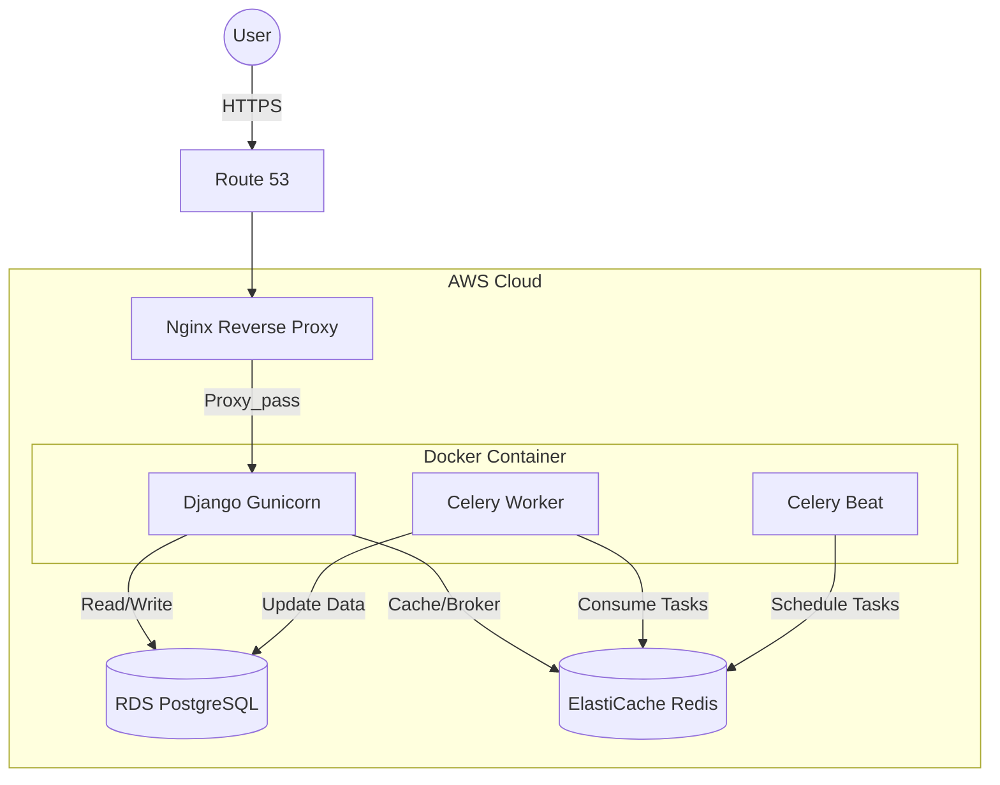

# 🐾 PetCare - Pet Shop Management System

[](https://github.com/CFBruna/petcare_project/actions/workflows/ci.yml)
[]()
[](https://www.python.org/downloads/)
[](https://docs.djangoproject.com/)
[](LICENSE)

> Production-grade pet shop management system (Django + DRF + Celery) with a real cloud migration case study (AWS → Azure), HTTPS automation, DNS cutover, and managed PostgreSQL.

**🚀 Live Demo:** [https://petcare.brunadev.com](https://petcare.brunadev.com) | **📊 Dashboard:** [https://petcare.brunadev.com/dashboard](https://petcare.brunadev.com/dashboard) | **📚 API Docs:** [Swagger UI](https://petcare.brunadev.com/api/v1/schema/swagger-ui/)

---

## 📸 Screenshots

### Landing Page


*Modern landing page with demo credentials and clean UX/UI design.*

---

### Analytics Dashboard (TypeScript)


*Real-time analytics dashboard built with React + TypeScript showing revenue metrics, appointment trends, and top products.*

---

### API Documentation (Swagger UI)


*RESTful API with multiple endpoints across accounts, pets, health, schedule, store, and analytics modules, documented following OpenAPI 3.0 specification.*

---

## 🎯 Quick Start

Test the live application deployed on **Azure production infrastructure** (migrated from AWS):

### 🔐 Demo Credentials

**Email:** recrutador@petcare.com
**Password:** avaliar123

**Access Points:**
- 🌐 **Main Application:** [https://petcare.brunadev.com](https://petcare.brunadev.com)
- 📊 **Dashboard:** [https://petcare.brunadev.com/dashboard](https://petcare.brunadev.com/dashboard)
- ⚙️ **Admin Panel:** [https://petcare.brunadev.com/admin](https://petcare.brunadev.com/admin)
- 📖 **API Documentation:** [Swagger UI](https://petcare.brunadev.com/api/v1/schema/swagger-ui/) | [ReDoc](https://petcare.brunadev.com/api/v1/schema/redoc/)

---

## 🏭️ Production Architecture (Current – Azure)

> **Note:** The diagram below represents the original AWS architecture before migration (Dec 2025). Current production runs on Azure with equivalent services.

This project runs on a modern, scalable cloud infrastructure:

**Infrastructure Components:**
- **Compute:** Azure Linux VM running containerized application (Docker)
- **Database:** Azure Database for PostgreSQL (managed service)
- **Cache & Queue:** Redis (containerized) for Celery task queue and caching
- **Web Server:** Nginx as reverse proxy and static file server
- **DNS:** HostGator DNS
- **Containerization:** Docker & Docker Compose for environment consistency



---

## 🔄 Cloud Migration: AWS → Azure (Real Production Case)

This project includes a **real-world cloud migration**, executed end-to-end in production.

### Migration Scope
- **Compute:** AWS EC2 → Azure Linux VM
- **Database:** AWS RDS PostgreSQL → Azure Database for PostgreSQL
- **Cache/Queue:** AWS ElastiCache → Containerized Redis
- **DNS:** Route 53 → HostGator DNS
- **SSL:** Re-issued with Let's Encrypt (Certbot)
- **Static files:** Rebuilt and collected post-migration

### Key Migration Steps
1. Provisioned Azure VM and PostgreSQL
2. Migrated database using `pg_dump` / `pg_restore`
3. Rebuilt Docker production stack
4. Reconfigured DNS with low TTL for safe cutover
5. Reissued SSL certificates and automated renewal
6. Decommissioned all AWS resources to eliminate costs

### Result
- ✅ Minimized downtime
- ✅ No data loss
- ✅ HTTPS preserved
- ✅ Emails (Zoho) unaffected

---

## ✨ Key Features

### 🧠 Smart Scheduling System
- **Automatic Availability Calculation:** Time slots calculated based on service duration and operating hours (8 AM - 8 PM)
- **Status Workflow:** Track appointments through lifecycle: Pending → Confirmed → Completed/Canceled
- **Service Management:** Configure specific durations and pricing for each service type
- **Conflict Prevention:** Real-time validation prevents double-booking

### 📦 Advanced Store & Inventory Management
- **Batch Tracking:** Products managed by **Lots** (`ProductLot`) with individual expiration dates and quantities
- **Dynamic Pricing Engine:**
  - **Manual Promotions:** Date-range based discounts on specific product lots
  - **Automatic Expiration Discounts:** Background tasks apply progressive discounts (30% < 7 days, 20% < 15 days, 10% < 30 days) to reduce waste
  - **Best Price Logic:** POS automatically applies lowest price between manual promotion vs. auto-discount
- **Sales Processing:** Point-of-sale interface with real-time inventory updates

### 🩺 Health & Pet Registry
- **Multi-Species Support:** Detailed profiles for Dogs, Cats, Birds, and more
- **Health Records:** Track vaccines, surgeries, consultations with "Next Due Date" reminders
- **Complete History:** Comprehensive medical timeline for each pet

### 📊 Dashboard & Analytics
- **Real-Time Metrics:** Daily revenue, confirmed appointments, and 7-day billing charts
- **Automated Reports:** Daily email summaries for sales, appointments, and promotions (Celery)
- **Data Visualization:** Interactive charts for revenue trends

### 🤖 AI Intelligence (Google Gemini Integration)

**Production-ready AI system** powered by Google Gemini 2.5 Flash with **3 specialized intelligent agents**:

#### 🗓️ AI Scheduling Agent
**Natural language appointment booking** with Gemini Function Calling:

**Core Capabilities:**
- **Natural Language Understanding:** Interprets colloquial Portuguese requests ("preciso de banho pro meu golden na sexta de manhã")
- **Intelligent Pet Search:** Finds pets by breed, species, age, or name
- **Smart Availability Checking:** Returns free time slots by day/period (morning/afternoon/evening)
- **Automatic Price Calculation:** Computes service costs with size-based adjustments (small/medium/large)
- **Conversational Responses:** Professional, friendly tone in Portuguese
- **Execution Transparency:** Tracks and reports all tool calls made

**Function Calling Architecture:**

The agent uses Gemini's native function calling to execute 3 core tools:

1. **`search_customer_pets`** - Semantic pet search
   - Supports breed matching ("golden retriever", "siamês")
   - Age filtering (min/max range)
   - Species filtering (dog, cat, bird, etc.)
   - Returns pet details with owner information

2. **`check_availability`** - Time slot lookup
   - Day-of-week support (PT/EN: "sábado", "saturday")
   - Period filtering (morning: 8-12h, afternoon: 12-17h, evening: 17-20h)
   - ISO date support ("2024-12-20")
   - Returns available slots with dates and times

3. **`calculate_price`** - Service pricing
   - Dynamic pricing by service type (grooming, consultation, vaccination)
   - Pet size adjustments (large breeds +20%)
   - Returns formatted price and estimated duration

**API Integration:**

```bash
curl -X POST https://petcare.brunadev.com/api/v1/ai/schedule-intent/ \
  -H "Content-Type: application/json" \
  -d '{
    "user_input": "Preciso de banho pro meu Golden de 5 anos, sábado de manhã",
    "customer_id": 1
  }'
```

**Response Structure:**

```json
{
  "message": "Encontrei o Thor! 🐕 Temos 3 horários disponíveis sábado de manhã: 09:00, 10:30 e 11:00. Banho e tosa para porte grande custa R$ 120,00 e leva cerca de 90 minutos. Qual horário prefere?",
  "tools_executed": [
    {
      "tool_name": "search_customer_pets",
      "arguments": {"species": "dog", "breed": "golden retriever", "age_min": 5, "age_max": 5},
      "result": [{"id": 1, "name": "Thor", "breed": "Golden Retriever", "age": 5}]
    },
    {
      "tool_name": "check_availability",
      "arguments": {"day": "saturday", "period": "morning"},
      "result": {"available_slots": [{"time": "09:00", "date": "12/20/2024"}]}
    },
    {
      "tool_name": "calculate_price",
      "arguments": {"service_name": "grooming", "pet_size": "large"},
      "result": {"formatted_price": "R$ 120,00", "duration_minutes": 90}
    }
  ],
  "intent_detected": "book_appointment",
  "confidence_score": 0.95
}
```

**Supported Input Patterns:**
- Breed mentions: "meu golden", "minha siamesa"
- Date references: "sábado", "amanhã", "próxima terça", "2024-12-25"
- Time periods: "manhã", "tarde", "noite", "morning", "afternoon"
- Service keywords: "banho", "consulta", "vacina", "grooming"

---

#### 📝 Product Intelligence Agent
**AI-powered product description generation** with RAG (Retrieval Augmented Generation):

**Dual Generation Modes:**

- **Technical Mode:**
  - Generates detailed, spec-focused descriptions for informed buyers
  - Uses **RAG** to find similar products via semantic search
  - Leverages **ChromaDB vector database** for embeddings similarity
  - Provides product recommendations based on vector proximity
  - Example: "15kg premium dog food with omega-3, grain-free, suitable for adult breeds 25-40kg"

- **Creative Mode:**
  - Creates engaging, marketing-focused copy
  - Highlights benefits and emotional appeal
  - Optimized for conversion and customer engagement
  - Example: "Dê ao seu melhor amigo a nutrição que ele merece! 🐾"

- **SEO Optimization:**
  - Auto-generates meta descriptions and keywords
  - Suggests product categorization
  - Improves search engine visibility

**Features:**
- **Real-time generation** from Django admin (AJAX integration)
- **Bulk actions** for multiple products simultaneously
- **Confidence scoring** for AI-generated content (0-1 scale)
- **Automatic embedding indexing** with Gemini Embeddings API
- **Custom admin templates** with visual feedback and loading states
- **Vector store persistence** for fast retrieval

**RAG Architecture:**
1. Product data → Gemini Embeddings API → 768-dim vectors
2. Vectors stored in ChromaDB (persistent local storage)
3. Query embedding → Similarity search → Top-K similar products
4. Similar products + context → Gemini LLM → Generated description

---

#### 🩺 Health Analysis Agent
**Advanced pet health monitoring** with Google Search Grounding:

**Pattern Detection:**
- Analyzes **6-month health history** for trends and anomalies
- Identifies potential health issues early (seasonality, recurrence)
- Uses **Google Search Grounding** to verify medical information against web sources
- Cites external veterinary sources for fact-checking
- Example: Detects "vaccine overdue by 45 days" or "3 ear infections in 4 months"

**Smart Alerts:**
- **Vaccine expiration warnings** (30/15/7 days before due)
- **Overdue checkup notifications** (annual wellness exams)
- **Medication schedule tracking** (antibiotic courses, chronic meds)
- **Weight changes** (sudden gain/loss flags)

**Health Scoring Algorithm (0-100):**
- Recent checkups: +20 points (within 6 months)
- Vaccines up-to-date: +30 points
- No active alerts: +20 points
- Normal weight trend: +15 points
- No recurring issues: +15 points
- Visual **dashboard integration** with color coding (green/yellow/red)

**AI-Powered Recommendations:**
- **Context-aware veterinary advice** based on breed, age, history
- **Breed-specific health tips** (e.g., hip dysplasia for large breeds)
- **Grounded in real-time web search** via Gemini Search Grounding
- **Cited sources** from veterinary websites and medical databases

**Technical Implementation:**
- **REST API integration** with Gemini (bypasses SDK limitations for advanced features)
- **Google Search Grounding** for medical fact-checking
- **Retry logic** with exponential backoff (2s → 4s → 8s)
- **Structured JSON parsing** from LLM responses
- **Real-time results** displayed in Django admin
- **Admin bulk actions** for analyzing multiple pets

---

#### 🔧 AI Technical Architecture

**AI Stack:**
- **LLM:** Google Gemini 2.5 Flash (`gemini-2.5-flash`)
- **Embeddings:** Google Gemini Embeddings API (`text-embedding-004`, 768 dimensions)
- **Vector DB:** ChromaDB 1.3+ (local, persistent, no separate server)
- **Orchestration:** LangChain 1.1+ (agent framework)
- **Function Calling:** Native Gemini tool use (for scheduling and search grounding)

**Key Design Patterns:**
- **Service Layer architecture** - No logic in admin/views, all AI logic in `services.py`
- **DTO pattern** - Clean API contracts with dataclasses (`SchedulingIntentRequest/Response`)
- **Retry mechanisms** - Exponential backoff for API rate limits and transient errors
- **RAG (Retrieval Augmented Generation)** - For product intelligence with ChromaDB
- **Streaming-ready infrastructure** - Designed for future real-time response streaming

**Performance Optimizations:**
- **Embedding caching** - Redis cache for frequently requested embeddings
- **Vector store persistence** - ChromaDB data persists across restarts (`chroma_db/` directory)
- **Batch processing** - Admin bulk actions process multiple items efficiently
- **Removed heavy dependencies** - Switched from sentence-transformers (2GB models) → Gemini API (cloud-based)
- **Docker build time:** 9min → 1min (8x faster) after dependency optimization

**Cost Efficiency:**
- **Free tier:** 1,500 requests/day with billing enabled
- **Gemini Embeddings:** Free tier for production use
- **Zero local model downloads** - All processing cloud-based
- **Automatic quota management** - Graceful degradation on quota exceeded

**Observability:**
- **Structured logging** with `structlog` (JSON format)
- **Tool execution tracking** - Full trace of function calls and results
- **Confidence scoring** - Transparency in AI certainty levels
- **Response time metrics** - Logged for performance monitoring

### 📅 Interactive Admin Calendar (React Big Calendar)
- **Visual Scheduling:** Drag-and-drop appointment management directly in Django admin
- **Multiple Views:** Month, week, and day calendar perspectives
- **Real-Time Sync:** Integrated with Django backend for live updates
- **Separate Build:** Independent Vite configuration (`vite.admin.config.ts`) for admin assets
- **Modern UI:** React-powered calendar with date-fns for date manipulation

**Build Admin Calendar:**
```bash
cd frontend
npx vite build --config vite.admin.config.ts
# Output: src/static/admin_calendar/
```

### 🛡️ Technical Highlights
- **94% Test Coverage** with pytest + factory-boy
- **CI/CD Pipeline** with GitHub Actions (lint, type-check, security scan, test)
- **Service Layer Architecture** for clean separation of concerns
- **Production-Ready Factories** for data seeding, testing, and Celery tasks
- **Structured Logging** with structlog for JSON-formatted production observability
- **OpenAPI Documentation** with drf-spectacular (Swagger/ReDoc)
- **Asynchronous Tasks** with Celery + Redis + django-celery-beat
- **Type Safety** with MyPy type checking
- **Code Quality** enforced by Ruff + pre-commit hooks
- **Modern Dependency Management** with uv (10-100x faster than pip)

---

## 🛠️ Tech Stack

**Backend**
- Python 3.12
- Django 5.2
- Django REST Framework 3.16
- Celery 5.4 (task queue)
- Gunicorn (WSGI server)

**Database & Cache**
- PostgreSQL 16
- Redis 7 (Celery broker + cache)

**AI/ML Stack**
- Google Gemini 2.5 Flash (LLM)
- Google Gemini Embeddings API (text-embedding-004)
- LangChain 1.1+ (orchestration)
- LangChain Google GenAI 4.0+ (Gemini integration)
- ChromaDB 1.3+ (vector database)

**Infrastructure**
- Azure Linux VM (Ubuntu 24.04)
- Azure Database for PostgreSQL
- Docker + Docker Compose (multi-stage builds)
- Nginx (reverse proxy + HTTPS termination)
- **Infra-Gateway:** Multi-domain Nginx architecture
- Let's Encrypt (Certbot with auto-renewal)
- HostGator DNS

**Frontend (Dashboard)**
- React 18 + TypeScript 5
- Vite 5 (build tool)
- Recharts (data visualization)
- Tailwind CSS
- Axios (HTTP client)

**Frontend (Admin Calendar)**
- React Big Calendar 1.19.4
- date-fns 4.1.0 (date utilities)
- Separate Vite build configuration

**Frontend (Client - Next.js)**
- Next.js 15 + React 19
- TypeScript 5
- Tailwind CSS
- Zustand (state management)
- TanStack Query (data fetching)
- Framer Motion (animations)
- Separate repository: [`petcare-web`](https://github.com/CFBruna/petcare-web)

**Deployment & Monitoring**
- Blue-Green Deployment Strategy
- Automated Backup/Rollback (keeps last 5)
- Health Check Monitoring
- Shell Scripting (deploy.sh - 266 lines)

**Code Quality & Testing**
- pytest + pytest-django
- factory-boy (test fixtures - **production-ready**)
- Ruff (linting)
- MyPy (type checking)
- Bandit (security scanning)
- Safety (dependency vulnerability checks)
- pre-commit hooks

**API Documentation**
- drf-spectacular (OpenAPI 3.0)

**Dependency Management**
- uv (Astral's blazing-fast Python package manager)

---

## 🚀 Local Development Setup

### Prerequisites
- [Docker Desktop](https://www.docker.com/products/docker-desktop/)
- [Git](https://git-scm.com/)

### Installation Steps

1. **Clone the repository**

```bash
git clone https://github.com/CFBruna/petcare_project.git
cd petcare_project
```

2. **Set up environment variables**

```bash
cp .env.example .env
```

> 💡 **Tip:** The default values in `.env.example` work out-of-the-box for local Docker development. Only edit if you need custom configuration.

3. **Build and start containers**

```bash
docker compose up --build -d
```

4. **Run database migrations**

```bash
docker compose exec web python manage.py migrate
```

5. **Create superuser**

```bash
docker compose exec web python manage.py createsuperuser
```

6. **Load sample data (optional)**

```bash
docker compose exec web python manage.py seed_db
```

7. **Access the application**
- Admin Panel: `http://127.0.0.1:8000/admin/`
- API Docs: `http://127.0.0.1:8000/api/v1/schema/swagger-ui/`

### 📊 Running the Analytics Dashboard (Frontend)

The analytics dashboard is a separate TypeScript frontend that consumes the Django API.

```bash
# Install Node.js dependencies
cd frontend
npm install

# Run development server (with hot reload)
npm run dev

# Access dashboard
# http://localhost:5173
```

The Vite dev server automatically proxies API requests to Django backend (`localhost:8000`).

**For Production Build:**
```bash
# Build frontend to Django static
./scripts/build-frontend.sh

# Output: src/static/dashboard/
```

---

## 🧪 Running Tests

Execute the complete test suite with coverage report:

```bash
docker compose exec web pytest --cov
```

With detailed output:

```bash
docker compose exec web pytest --cov --cov-report=html -v
```

Run specific test file:

```bash
docker compose exec web pytest src/apps/pets/tests/test_models.py -v
```

**Coverage Report:** The project maintains **94% test coverage** across all modules.

---

## 📚 API Documentation

The API follows OpenAPI 3.0 specification and provides interactive documentation:

**Local Development:**
- Swagger UI: `http://127.0.0.1:8000/api/v1/schema/swagger-ui/`
- ReDoc: `http://127.0.0.1:8000/api/v1/schema/redoc/`

**Production:**
- Swagger UI: `https://petcare.brunadev.com/api/v1/schema/swagger-ui/`
- ReDoc: `https://petcare.brunadev.com/api/v1/schema/redoc/`

### API Endpoints Overview

| Resource | Endpoint | Methods | Description |
|----------|----------|---------|-------------|
| Customers | `/api/v1/customers/` | GET, POST, PUT, DELETE | Manage pet owners |
| Pets | `/api/v1/pets/` | GET, POST, PUT, DELETE | Manage registered pets |
| Appointments | `/api/v1/appointments/` | GET, POST, PUT, DELETE | Schedule services |
| Products | `/api/v1/products/` | GET, POST, PUT, DELETE | Manage inventory |
| Sales | `/api/v1/sales/` | GET, POST | Process transactions |

---

---

## ⚙️ Background Tasks (Celery)

The system uses Celery Beat for automated scheduled tasks. All tasks are configured with `America/Sao_Paulo` timezone:

| Task | Schedule | Description |
|------|----------|-------------|
| `simulate_daily_activity` | **02:00 AM BRT** | Generates realistic demo data (customers, sales, appointments) to keep the demo environment active |
| `generate_daily_sales_report` | **01:05 AM BRT** | Emails daily sales summary to admin with revenue metrics |
| `generate_daily_promotions_report` | **01:10 AM BRT** | Reports active promotions and promotional stock levels |
| `apply_expiration_discounts` | **01:30 AM BRT** | **Business Rule:- **Scheduled Discounts:** Expired products don't sit—they auto-discount:<br>• **30 days before** expiration: 10%<br>• **15 days before**: 20%<br>• **7 days before**: 30% |

### 📊 Analytics Dashboard (TypeScript)
- **Interactive Dashboard:** Real-time business metrics visualization
- **TypeScript + React:** Modern frontend with strict type safety
- **Recharts Integration:** Professional charts for revenue and appointments trends
- **Responsive Design:** Tailwind CSS with mobile-first approach
- **API Integration:** Type-safe Axios service consuming Django REST endpoints
- **Period Filtering:** Dynamic data for 7/30/90 days
- **Portuguese UI:** Localized interface for Brazilian market

### Manual Task Execution

Trigger the data simulation manually for testing:

```bash
docker compose exec web python manage.py shell -c "
from src.apps.store.tasks import simulate_daily_activity
result = simulate_daily_activity()
print(result)
"
```

**Expected Output:**
```
2025-12-07T05:00:00.502290Z [info] simulate_daily_activity_started
Time slots (Mon-Fri, 08h-20h) ensured.
Created 5 new customers.
Created product 'Ração Premium para Cães Adultos 15kg' with 2 lots.
Created product 'Shampoo Antipulgas e Carrapatos 500ml' with 2 lots.
Created product 'Petisco Natural de Frango Desidratado 200g' with 2 lots.
Created 5 sales for yesterday.
Created 7 appointments.
Created 4 health records.
Created 2 manual promotions.
Triggered automatic expiration discounts task.
```

---

## 🔄 CI/CD Pipeline

Every push or pull request to `main` triggers an automated pipeline:

1. 📦 Install Dependencies (uv)
2. 🔍 Type Check (MyPy)
3. ✨ Lint Code (Ruff)
4. 🛡️ Security Scan (Bandit + Safety)
5. 🧪 Run Tests (pytest) + Coverage Report
6. ✅ Quality Gate: 90%+ coverage required

View workflow: [.github/workflows/ci.yml](.github/workflows/ci.yml)

---

## 🚀 Production Deployment

### Blue-Green Deployment Strategy

The project includes a production-grade deployment script (`deploy.sh`) with zero-downtime deployment:

**Features:**
- ✅ **Automated Backup:** Full system backup before each deployment (keeps last 5)
- ✅ **Zero-Downtime:** Blue-green strategy with rolling container updates
- ✅ **Automatic Rollback:** Reverts to previous version on failure
- ✅ **Health Checks:** API and dashboard verification post-deployment
- ✅ **Dual Deployment:** Deploys both Django app + TypeScript dashboard
- ✅ **Safety First:** 10-step process with logging and error handling

**Deploy to Production:**
```bash
./deploy.sh
```

**Deployment Steps:**
1. Pre-flight checks (branch validation, git pull)
2. Create full system backup
3. Build TypeScript dashboard and admin calendar
4. Build Docker images (no deployment yet)
5. Test new build in staging
6. Deploy with zero downtime (rolling updates)
7. Run database migrations
8. Deploy dashboard assets
9. Health checks (API + Dashboard)
10. Cleanup old backups

**Rollback if Needed:**
```bash
./rollback.sh backups/deployment-YYYYMMDD-HHMMSS
```

### Multi-Domain Architecture (Infra-Gateway)

The application integrates with `infra-gateway` for centralized Nginx management:

- **Main Site:** `brunadev.com` (static portfolio)
- **PetCare App:** `petcare.brunadev.com` (Django application)
- **Shared SSL:** Let's Encrypt certificates managed centrally
- **Reverse Proxy:** Nginx routes traffic to appropriate services
- **Benefits:** Simplified SSL management, centralized routing, easy multi-service deployment

### Health Monitoring

Production deployment includes automated health checks:

- **API Health:** `/api/v1/status/` endpoint verification (15 retries, 2s interval)
- **Dashboard Health:** Frontend availability check
- **Post-Deployment:** Automatic validation after updates
- **Failure Handling:** Automatic rollback if health checks fail


## 📁 Project Structure

```
petcare_project/
├── src/
│   ├── apps/
│   │   ├── accounts/
│   │   │   ├── factories.py         # ✨ Production-ready factories
│   │   │   ├── models.py
│   │   │   ├── services.py
│   │   │   ├── api/
│   │   │   └── tests/
│   │   ├── analytics/           # Dashboard metrics & business intelligence
│   │   │   ├── serializers.py   # API response schemas
│   │   │   ├── services.py      # Optimized analytics queries (5 queries)
│   │   │   ├── views.py         # Dashboard endpoint with OpenAPI docs
│   │   │   └── tests/
│   │   │       ├── test_api.py       # API endpoint tests
│   │   │       └── test_services.py  # Service layer tests
│   │   ├── pets/                    # Pet registration
│   │   │   ├── factories.py         # ✨ Production factories
│   │   │   └── ...
│   │   ├── health/                  # Health records
│   │   │   ├── factories.py         # ✨ Production factories
│   │   │   └── ...
│   │   ├── schedule/                # Appointment system
│   │   │   ├── factories.py         # ✨ Production factories
│   │   │   ├── services.py
│   │   │   └── ...
│   │   ├── store/                   # Products, sales, promotions
│   │   │   ├── factories.py         # ✨ Production factories
│   │   │   ├── tasks.py             # ✨ Celery tasks with logging
│   │   │   ├── services.py
│   │   │   └── ...
│   │   └── core/                    # Shared utilities
│   │       └── management/commands/
│   │           └── seed_db.py       # Database seeding
│   ├── petcare/
│   │   ├── settings.py              # Django settings
│   │   ├── urls.py                  # Main URL configuration
│   │   └── celery.py                # Celery config
│   └── conftest.py                  # Pytest fixtures
├── frontend/                         # Analytics Dashboard (TypeScript)
│   ├── src/
│   │   ├── components/              # React components
│   │   │   ├── MetricsCard.tsx      # KPI display cards
│   │   │   ├── RevenueChart.tsx     # Recharts line chart
│   │   │   └── TopProductsTable.tsx # Product ranking table
│   │   ├── services/
│   │   │   └── api.ts               # Type-safe Axios client
│   │   ├── types/
│   │   │   └── dashboard.ts         # TypeScript interfaces
│   │   ├── App.tsx                  # Main dashboard component
│   │   └── main.tsx                 # React entry point
│   ├── vite.config.ts               # Vite build config (/dashboard/ base)
│   ├── tailwind.config.js           # Tailwind CSS config
│   └── package.json                 # Frontend dependencies
├── .github/workflows/               # CI/CD pipelines
│   └── ci.yml
├── docker-compose.yml               # Local development
├── docker-compose.prod.yml          # Production config
├── Dockerfile                       # Container definition
├── pyproject.toml                   # uv dependencies
├── uv.lock                          # Locked dependencies
└── pytest.ini                       # Test configuration
```

**Key Architecture Decisions:**
- ✨ **Factories in Production:** Factory classes live outside `tests/` directories, enabling use in management commands, Celery tasks, and seeding scripts
- 🏗️ **Service Layer:** All business logic isolated in `services.py`, keeping models thin and views clean
- 📊 **Structured Logging:** All Celery tasks use `structlog` for JSON-formatted logs with full observability

---

## 🌟 Key Learnings & Highlights

This project demonstrates proficiency in:

- ✅ **Clean Architecture:** Service Layer + Repository Pattern for maintainable code
- ✅ **Cloud Migration:** Real-world AWS → Azure migration with zero downtime
- ✅ **Production Deployment:** Blue-green strategy with automated backup/rollback
- ✅ **DevOps Practices:** Docker, CI/CD, automated testing, security scanning, health monitoring
- ✅ **Multi-Domain Architecture:** Infra-gateway integration for centralized Nginx management
- ✅ **Test-Driven Development:** 94% coverage with unit and integration tests
- ✅ **Production-Ready Patterns:** Factories as first-class citizens, structured logging
- ✅ **API Design:** RESTful endpoints with comprehensive OpenAPI documentation
- ✅ **Asynchronous Processing:** Celery for background tasks with robust error handling
- ✅ **Type Safety:** MyPy type checking for better code reliability
- ✅ **Modern Frontend:** React + TypeScript dashboard with Recharts visualization
- ✅ **Admin Enhancement:** Interactive calendar with React Big Calendar integration
- ✅ **Modern Tooling:** uv for dependency management, Ruff for linting

---

## 🔧 Development Tools

### Dependency Management (uv)

This project uses [uv](https://github.com/astral-sh/uv) for fast, reliable dependency management:

```bash
# Install dependencies
uv sync

# Add a new dependency
uv add django-extensions

# Add a dev dependency
uv add --dev pytest-xdist

# Update dependencies
uv sync --upgrade
```

### Code Quality

```bash
# Lint code
docker compose exec web ruff check .

# Format code
docker compose exec web ruff format .

# Type check
docker compose exec web mypy .

# Security scan
docker compose exec web bandit -r src/
```

---

## 📄 License

This project is licensed under a **Proprietary License**. All rights reserved. See the [LICENSE](LICENSE) file for details.

For licensing inquiries or permission requests, please contact [brunaads.ti@gmail.com](mailto:brunaads.ti@gmail.com).

---

## 👤 Author

**Bruna Menezes**
- GitHub: [@CFBruna](https://github.com/CFBruna)
- LinkedIn: [bruna-c-menezes](https://www.linkedin.com/in/bruna-c-menezes/)
- Email: brunaads.ti@gmail.com

---

**⭐ If you find this project helpful, please give it a star!**
