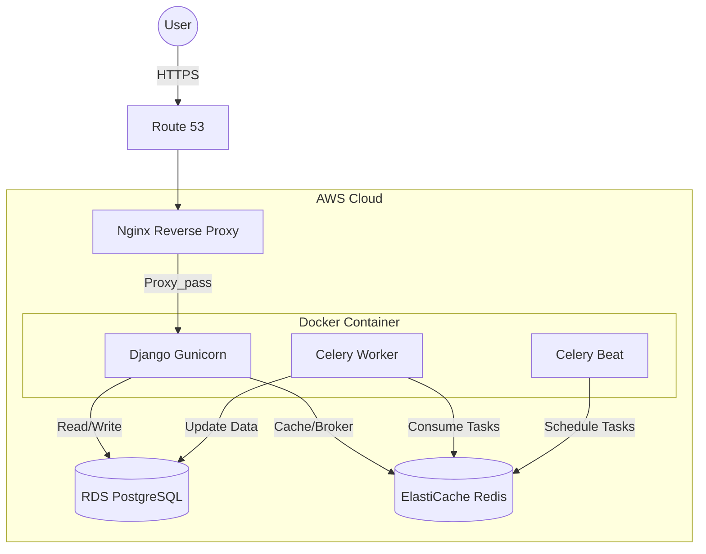

# 🐾 PetCare - Pet Shop Management System

[](https://github.com/CFBruna/petcare_project/actions/workflows/ci.yml)
[]()
[](https://www.python.org/downloads/)
[](https://docs.djangoproject.com/)
[](https://opensource.org/licenses/MIT)

> Production-grade pet shop management system (Django + DRF + Celery) with a real cloud migration case study (AWS → Azure), HTTPS automation, DNS cutover, and managed PostgreSQL.

**🚀 Live Demo:** [https://petcare.brunadev.com](https://petcare.brunadev.com) | **📊 Dashboard:** [https://petcare.brunadev.com/dashboard](https://petcare.brunadev.com/dashboard) | **📚 API Docs:** [Swagger UI](https://petcare.brunadev.com/api/v1/schema/swagger-ui/)

---

## 📸 Screenshots

### Landing Page


*Modern landing page with demo credentials and clean UX/UI design.*

---

### Analytics Dashboard (TypeScript)


*Production analytics dashboard built with React + TypeScript showing revenue metrics, appointment trends, and top products. Deployed at [/dashboard](https://petcare.brunadev.com/dashboard).*

---

### API Documentation (Swagger UI)


*RESTful API with 15+ endpoints documented following OpenAPI 3.0 specification.*

---

## 🎯 Quick Start

Test the live application deployed on **Azure production infrastructure** (migrated from AWS):

### 🔐 Demo Credentials

**Email:** recrutador@petcare.com  
**Password:** avaliar123

### 🎯 Access Points

- 🌐 **Main Application:** [https://petcare.brunadev.com](https://petcare.brunadev.com)
- 🖥️ **Admin Panel:** [https://petcare.brunadev.com/admin](https://petcare.brunadev.com/admin)
- 📖 **API Documentation:** [Swagger UI](https://petcare.brunadev.com/api/v1/schema/swagger-ui/) | [ReDoc](https://petcare.brunadev.com/api/v1/schema/redoc/)
- 📊 **Analytics Dashboard:** [https://petcare.brunadev.com/dashboard](https://petcare.brunadev.com/dashboard) *(TypeScript/React SPA)*

---

## 🏭 Production Infrastructure & Cloud Migration Journey

This project demonstrates real-world **production deployment experience** and **multi-cloud proficiency** through a complete infrastructure migration from **AWS → Azure**, executed with minimized downtime and full service preservation.

### 🎯 Migration Overview: AWS → Azure

**Business Context:**  
Originally deployed on AWS with a complete production stack, I proactively migrated the entire infrastructure to Azure to reduce costs and simplify operations. This migration showcases end-to-end cloud engineering skills: infrastructure provisioning, database migration, DNS cutover with low TTL, SSL automation, and legacy resource cleanup.

---

### 🏗️ Original AWS Architecture (Phase 1)

The initial production deployment on AWS utilized:

- **EC2 Instance** — Dockerized application stack (Django + Gunicorn, Nginx, Redis, Celery)
- **RDS PostgreSQL** — Managed relational database with automated backups
- **ElastiCache Redis** — In-memory cache for Celery task queue and session storage
- **Route 53** — DNS management for `brunadev.com` and `petcare.brunadev.com`
- **Zoho Mail** — Custom domain email with MX/SPF/DKIM records



---

### ☁️ Current Azure Architecture (Phase 2)

**Migration completed in December 2025** with the following infrastructure:

#### Compute & Application Layer
- **Azure Linux VM (Ubuntu 24.04)** — Provisioned and configured with SSH key-based authentication
- **Docker Compose Production Stack:**
  - `web` — Django 5.2 + Gunicorn WSGI server
  - `nginx` — Reverse proxy with HTTPS termination
  - `redis` — Local containerized Redis (eliminated ElastiCache dependency)
  - `celery_worker` + `celery_beat` — Background task processing

#### Database
- **Azure Database for PostgreSQL** — Managed database service
- **Migration Process:**
  - Exported full database from AWS RDS using `pg_dump`
  - Securely transferred 500MB+ dump file to Azure VM via SCP
  - Restored using `pg_restore` with proper role mappings and permissions
  - Validated data integrity with row counts and critical table checks

#### DNS & Domain Management
- **Migrated from Route 53 → HostGator DNS:**
  - Configured `A` records for root domain and subdomain (`brunadev.com`, `petcare.brunadev.com`)
  - Set up `CNAME` for `www.brunadev.com → brunadev.com`
  - Preserved **Zoho Mail** configuration with `MX`, `SPF`, and `DKIM` records
  - Validated global DNS propagation using Cloudflare (1.1.1.1) and Google (8.8.8.8) resolvers
  - Tools: `nslookup`, `dig`, whatsmydns.net

#### HTTPS & Security
- **Let's Encrypt SSL Certificates** for dual-domain support:
  - `brunadev.com` + `petcare.brunadev.com` (wildcard alternative)
  - Certificate issuance: `certbot certonly --standalone` (ports 80/443)
  - **Automated renewal** via certbot system timer with deploy-hook:
    ```bash
    sudo certbot renew --deploy-hook "docker compose -f ~/petcare_project/docker-compose.prod.yml restart nginx"
    ```
  - Validation: `openssl s_client -connect brunadev.com:443 -servername brunadev.com`

---

### 🔄 Migration Execution Highlights

> **Result:** Minimized downtime migration preserving all functionality — landing page, API, dashboard, admin panel, scheduled tasks, and email delivery.

#### 1. **Infrastructure Provisioning**
   - Provisioned Azure VM with optimized compute tier (cost vs. performance balance)
   - Configured firewall rules (ports 22, 80, 443)
   - Installed Docker Engine and Docker Compose

#### 2. **Application Deployment**
   - Cloned repository and deployed using `docker-compose.prod.yml`
   - Configured environment variables (`.env`) for Azure resources
   - Built and launched multi-container stack with health checks

#### 3. **Database Migration**
   - **Challenge:** Migrate 500MB+ production database without data loss
   - **Solution:**
     ```bash
     # Source (AWS RDS)
     pg_dump -h rds-endpoint -U postgres -Fc petcare_db > petcare_backup.dump
     
     # Transfer
     scp petcare_backup.dump azure-vm:/tmp/
     
     # Target (Azure PostgreSQL)
     pg_restore -h azure-postgres.postgres.database.azure.com \
                -U petcare_admin -d petcare_db petcare_backup.dump
     ```
   - **Validation:** Row count verification, foreign key integrity checks

#### 4. **DNS Cutover**
   - Updated A records to point to Azure VM IP (`20.157.194.30`)
   - Monitored TTL expiration (300s) for propagation
   - Tested with multiple geographic DNS resolvers to confirm global availability

#### 5. **SSL Certificate Re-issuance**
   - Temporarily stopped Nginx to free ports 80/443 for ACME challenge
   - Issued new certificates for both domains in single command
   - Configured auto-renewal cron job for maintenance-free SSL

#### 6. **Static Files Fix**
   - **Issue:** Django admin panel loaded without CSS (permission error on `collectstatic`)
   - **Solution:**
     ```bash
     docker compose exec --user root web sh -c \
       'mkdir -p /usr/src/app/staticfiles && chmod -R 777 /usr/src/app/staticfiles'
     docker compose exec web python manage.py collectstatic --noinput
     ```

#### 7. **AWS Resource Cleanup**
   - Systematically decommissioned all billable resources:
     - Terminated EC2 instance
     - Deleted RDS PostgreSQL instance and snapshots
     - Removed ElastiCache Redis cluster
     - Deleted Route 53 hosted zone
     - Cleaned up unused EBS volumes and security groups
   - **Result:** $0/month AWS bill (eliminated ongoing costs)

---

### 📊 Technical Skills Demonstrated

| **Skill Area** | **Technologies & Practices** |
|----------------|------------------------------|
| **Cloud Platforms** | AWS (EC2, RDS, ElastiCache, Route 53) → Azure (VM, PostgreSQL) |
| **Infrastructure as Code** | Docker, Docker Compose, production configurations |
| **Database Administration** | PostgreSQL migration (`pg_dump`, `pg_restore`), managed databases |
| **Networking & DNS** | DNS record management, nameserver migration, TTL optimization |
| **Security & SSL** | Let's Encrypt automation, certificate renewal, HTTPS enforcement |
| **Linux System Administration** | Ubuntu server configuration, SSH hardening, cron jobs |
| **DevOps** | Zero-downtime deployment, rollback strategies, monitoring |

---

### 🎓 Key Takeaways

- ✅ **Cost Optimization:** Reduced monthly cloud spend without compromising performance
- ✅ **Risk Management:** Planned migration with rollback strategy (AWS resources kept alive during validation period)
- ✅ **Automation:** Implemented certificate auto-renewal to prevent SSL expiry incidents
- ✅ **Documentation:** Maintained detailed migration logs for knowledge sharing and auditing

---

## ✨ Key Features

### � Smart Scheduling System
- **Automatic Availability Calculation:** Time slots calculated based on service duration and operating hours (8 AM - 8 PM)
- **Status Workflow:** Track appointments through lifecycle: Pending → Confirmed → Completed/Canceled
- **Service Management:** Configure specific durations and pricing for each service type
- **Conflict Prevention:** Real-time validation prevents double-booking

### 📦 Advanced Store & Inventory Management
- **Batch Tracking:** Products managed by **Lots** (`ProductLot`) with individual expiration dates and quantities
- **Dynamic Pricing Engine:**
  - **Manual Promotions:** Date-range based discounts on specific product lots
  - **Automatic Expiration Discounts:** Background tasks apply progressive discounts (30% < 7 days, 20% < 15 days, 10% < 30 days) to reduce waste
  - **Best Price Logic:** POS automatically applies lowest price between manual promotion vs. auto-discount
- **Sales Processing:** Point-of-sale interface with real-time inventory updates

### 🩺 Health & Pet Registry
- **Multi-Species Support:** Detailed profiles for Dogs, Cats, Birds, and more
- **Health Records:** Track vaccines, surgeries, consultations with "Next Due Date" reminders
- **Complete History:** Comprehensive medical timeline for each pet

### 📊 Dashboard & Analytics
- **Real-Time Metrics:** Daily revenue, confirmed appointments, and 7-day billing charts
- **Automated Reports:** Daily email summaries for sales, appointments, and promotions (Celery)
- **Data Visualization:** Interactive charts for revenue trends

### 🛡️ Technical Highlights
- **94% Test Coverage** with pytest + factory-boy
- **CI/CD Pipeline** with GitHub Actions (lint, type-check, security scan, test)
- **Service Layer Architecture** for clean separation of concerns
- **Production-Ready Factories** for data seeding, testing, and Celery tasks
- **Structured Logging** with structlog for JSON-formatted production observability
- **OpenAPI Documentation** with drf-spectacular (Swagger/ReDoc)
- **Asynchronous Tasks** with Celery + Redis + django-celery-beat
- **Type Safety** with MyPy strict mode
- **Code Quality** enforced by Ruff + pre-commit hooks
- **Modern Dependency Management** with uv (10-100x faster than pip)

---

## 🛠️ Tech Stack

**Backend**
- Python 3.12
- Django 5.2
- Django REST Framework 3.16
- Celery 5.4 (task queue)
- Gunicorn (WSGI server)

**Frontend**
- TypeScript 5.3
- React 18
- Vite 5.0 (build tool)
- Recharts 2.10 (data visualization)
- Tailwind CSS 3.4 (styling)
- Axios (HTTP client)

**Database & Cache**
- Azure Database for PostgreSQL (v17)
- Redis 7 (containerized — Celery broker + cache)

**Infrastructure & Cloud**
- **Current:** Azure VM (Ubuntu 24.04), Azure Database for PostgreSQL
- **Previous:** AWS (EC2, RDS, ElastiCache, Route 53)
- Docker + Docker Compose (production deployment)
- Nginx (reverse proxy + HTTPS termination)
- Let's Encrypt (SSL certificates with auto-renewal)
- HostGator DNS (domain management)

**Code Quality & Testing**
- pytest + pytest-django
- factory-boy (test fixtures - **production-ready**)
- Ruff (linting)
- MyPy (type checking)
- Bandit (security scanning)
- Safety (dependency vulnerability checks)
- pre-commit hooks

**API Documentation**
- drf-spectacular (OpenAPI 3.0)

**Dependency Management**
- uv (Astral's blazing-fast Python package manager)

---

## 🚀 Local Development Setup

### Prerequisites
- [Docker Desktop](https://www.docker.com/products/docker-desktop/)
- [Git](https://git-scm.com/)

### Installation Steps

1. **Clone the repository**

```bash
git clone https://github.com/CFBruna/petcare_project.git
cd petcare_project
```

2. **Set up environment variables**

```bash
cp .env.example .env
```

> 💡 **Tip:** The default values in `.env.example` work out-of-the-box for local Docker development. Only edit if you need custom configuration.

3. **Build and start containers**

```bash
docker compose up --build -d
```

4. **Run database migrations**

```bash
docker compose exec web python manage.py migrate
```

5. **Create superuser**

```bash
docker compose exec web python manage.py createsuperuser
```

6. **Load sample data (optional)**

```bash
docker compose exec web python manage.py seed_db
```

7. **Access the application**
- Admin Panel: `http://127.0.0.1:8000/admin/`
- API Docs: `http://127.0.0.1:8000/api/v1/schema/swagger-ui/`

### 📊 Running the Analytics Dashboard (Frontend)

The analytics dashboard is a separate TypeScript frontend that consumes the Django API.

```bash
# Install Node.js dependencies
cd frontend
npm install

# Run development server (with hot reload)
npm run dev

# Access dashboard
# http://localhost:5173
```

The Vite dev server automatically proxies API requests to Django backend (`localhost:8000`).

**For Production Build:**
```bash
# Build frontend to Django static
./scripts/build-frontend.sh

# Output: src/static/dashboard/
```

---

## 🧪 Running Tests

Execute the complete test suite with coverage report:

```bash
docker compose exec web pytest --cov
```

With detailed output:

```bash
docker compose exec web pytest --cov --cov-report=html -v
```

Run specific test file:

```bash
docker compose exec web pytest src/apps/pets/tests/test_models.py -v
```

**Coverage Report:** The project maintains **94% test coverage** across all modules.

---

## 📚 API Documentation

The API follows OpenAPI 3.0 specification and provides interactive documentation:

**Local Development:**
- Swagger UI: `http://127.0.0.1:8000/api/v1/schema/swagger-ui/`
- ReDoc: `http://127.0.0.1:8000/api/v1/schema/redoc/`

**Production:**
- Swagger UI: `http://petcare.brunadev.com/api/v1/schema/swagger-ui/`
- ReDoc: `http://petcare.brunadev.com/api/v1/schema/redoc/`

### API Endpoints Overview

| Resource | Endpoint | Methods | Description |
|----------|----------|---------|-------------|
| Customers | `/api/v1/customers/` | GET, POST, PUT, DELETE | Manage pet owners |
| Pets | `/api/v1/pets/` | GET, POST, PUT, DELETE | Manage registered pets |
| Appointments | `/api/v1/appointments/` | GET, POST, PUT, DELETE | Schedule services |
| Products | `/api/v1/products/` | GET, POST, PUT, DELETE | Manage inventory |
| Sales | `/api/v1/sales/` | GET, POST | Process transactions |

---

---

## ⚙️ Background Tasks (Celery)

The system uses Celery Beat for automated scheduled tasks. All tasks are configured with `America/Sao_Paulo` timezone:

| Task | Schedule | Description |
|------|----------|-------------|
| `simulate_daily_activity` | **02:00 AM BRT** | Generates realistic demo data (customers, sales, appointments) to keep the demo environment active |
| `generate_daily_sales_report` | **01:05 AM BRT** | Emails daily sales summary to admin with revenue metrics |
| `generate_daily_promotions_report` | **01:10 AM BRT** | Reports active promotions and promotional stock levels |
| `apply_expiration_discounts` | **01:30 AM BRT** | **Business Rule:- **Scheduled Discounts:** Expired products don't sit—they auto-discount:<br>• **30 days before** expiration: 10%<br>• **15 days before**: 20%<br>• **7 days before**: 30% |


### 📊 Analytics Dashboard — TypeScript + React Frontend

A fully-developed business intelligence dashboard built with **modern frontend technologies**, demonstrating full-stack capabilities beyond Django backend development.

> **Current Status:**  
> ✅ **Development Ready:** Fully functional TypeScript/React application with local dev server  
> ✅ **Backend API Operational:** `/api/v1/analytics/dashboard/` endpoint deployed and tested in production  
> 🚧 **Frontend Production Deployment:** Planned (build pipeline + Django integration in progress)

#### Technical Stack
- **React 18** with hooks (useState, useEffect) for state management
- **TypeScript** with strict mode for compile-time type safety
- **Vite** for blazing-fast development and optimized production builds
- **Recharts** for interactive, responsive data visualization
- **Tailwind CSS** for utility-first, mobile-responsive design
- **Axios** with typed API service layer

#### Architecture & Integration
- **Type-Safe API Client:**
  - Defined TypeScript interfaces matching Django REST Framework serializers
  - Centralized Axios instance with base URL configuration
  - Error handling and loading states for improved UX

  ```typescript
  // src/types/dashboard.ts
  export interface DashboardData {
    daily_revenue: number;
    confirmed_appointments: number;
    revenue_chart: Array<{ date: string; revenue: number }>;
    top_products: Array<{ name: string; quantity: number; revenue: number }>;
  }
  ```

- **Backend Integration:**
  - Consumes Django REST endpoint: `/api/v1/analytics/dashboard/`
  - Supports dynamic period filtering (7/30/90 days) via query params
  - Optimized backend queries (5 SQL queries total) using `select_related()` and aggregations

- **Production Build Process:**
  - Vite builds static assets to `src/static/dashboard/`
  - Django `collectstatic` gathers assets for Nginx serving
  - Base path configured to `/dashboard/` for proper routing under main domain

#### Development Highlights
- **Responsive Design:** Mobile-first approach with Tailwind breakpoints (`sm:`, `md:`, `lg:`)
- **Component Architecture:** Reusable `MetricsCard`, `RevenueChart`, `TopProductsTable` components
- **Portuguese Localization:** UI strings and number formatting for Brazilian market (R$ currency)
- **Loading States:** Skeleton screens and spinners during API fetches
- **Error Handling:** User-friendly error messages with retry mechanisms

#### Deployment
- **Development:** Vite dev server (`npm run dev`) with hot module replacement on port 5173, proxying API requests to Django backend
- **Backend API (Production):** Analytics endpoint live at `petcare.brunadev.com/api/v1/analytics/dashboard/`
- **Frontend (Planned):** Build script (`scripts/build-frontend.sh`) ready to compile assets to `src/static/dashboard/` for Django TemplateView serving

**Why TypeScript?**  
Demonstrates proficiency in **statically-typed languages** and modern JavaScript ecosystem, complementing Python/Django backend skills. Type safety reduces runtime errors and improves maintainability in production environments.

**Next Steps for Production:**
1. Execute `npm run build` to compile TypeScript/React to static assets
2. Create Django TemplateView to serve built `index.html`
3. Configure Nginx route for `/dashboard/` path
4. Run `collectstatic` and deploy


### Manual Task Execution

Trigger the data simulation manually for testing:

```bash
docker compose exec web python manage.py shell -c "
from src.apps.store.tasks import simulate_daily_activity
result = simulate_daily_activity()
print(result)
"
```

**Expected Output:**
```
2025-12-07T05:00:00.502290Z [info] simulate_daily_activity_started
Time slots (Mon-Fri, 08h-20h) ensured.
Created 5 new customers.
Created product 'Ração Premium para Cães Adultos 15kg' with 2 lots.
Created product 'Shampoo Antipulgas e Carrapatos 500ml' with 2 lots.
Created product 'Petisco Natural de Frango Desidratado 200g' with 2 lots.
Created 5 sales for yesterday.
Created 7 appointments.
Created 4 health records.
Created 2 manual promotions.
Triggered automatic expiration discounts task.
```

---

## 🔄 CI/CD Pipeline

Every push or pull request to `main` triggers an automated pipeline:

1. 📦 Install Dependencies (uv)
2. 🔍 Type Check (MyPy)
3. ✨ Lint Code (Ruff)
4. 🛡️ Security Scan (Bandit + Safety)
5. 🧪 Run Tests (pytest) + Coverage Report
6. ✅ Quality Gate: 90%+ coverage required

View workflow: [.github/workflows/ci.yml](.github/workflows/ci.yml)

---

## 📁 Project Structure

```
petcare_project/
├── src/
│   ├── apps/
│   │   ├── accounts/
│   │   │   ├── factories.py         # ✨ Production-ready factories
│   │   │   ├── models.py
│   │   │   ├── services.py
│   │   │   ├── api/
│   │   │   └── tests/
│   │   ├── analytics/           # Dashboard metrics & business intelligence
│   │   │   ├── serializers.py   # API response schemas
│   │   │   ├── services.py      # Optimized analytics queries (5 queries)
│   │   │   ├── views.py         # Dashboard endpoint with OpenAPI docs
│   │   │   └── tests/
│   │   │       ├── test_api.py       # API endpoint tests
│   │   │       └── test_services.py  # Service layer tests
│   │   ├── pets/                    # Pet registration
│   │   │   ├── factories.py         # ✨ Production factories
│   │   │   └── ...
│   │   ├── health/                  # Health records
│   │   │   ├── factories.py         # ✨ Production factories
│   │   │   └── ...
│   │   ├── schedule/                # Appointment system
│   │   │   ├── factories.py         # ✨ Production factories
│   │   │   ├── services.py
│   │   │   └── ...
│   │   ├── store/                   # Products, sales, promotions
│   │   │   ├── factories.py         # ✨ Production factories
│   │   │   ├── tasks.py             # ✨ Celery tasks with logging
│   │   │   ├── services.py
│   │   │   └── ...
│   │   └── core/                    # Shared utilities
│   │       └── management/commands/
│   │           └── seed_db.py       # Database seeding
│   ├── petcare/
│   │   ├── settings.py              # Django settings
│   │   ├── urls.py                  # Main URL configuration
│   │   └── celery.py                # Celery config
│   └── conftest.py                  # Pytest fixtures
├── frontend/                         # Analytics Dashboard (TypeScript)
│   ├── src/
│   │   ├── components/              # React components
│   │   │   ├── MetricsCard.tsx      # KPI display cards
│   │   │   ├── RevenueChart.tsx     # Recharts line chart
│   │   │   └── TopProductsTable.tsx # Product ranking table
│   │   ├── services/
│   │   │   └── api.ts               # Type-safe Axios client
│   │   ├── types/
│   │   │   └── dashboard.ts         # TypeScript interfaces
│   │   ├── App.tsx                  # Main dashboard component
│   │   └── main.tsx                 # React entry point
│   ├── vite.config.ts               # Vite build config (/dashboard/ base)
│   ├── tailwind.config.js           # Tailwind CSS config
│   └── package.json                 # Frontend dependencies
├── .github/workflows/               # CI/CD pipelines
│   └── ci.yml
├── docker-compose.yml               # Local development
├── docker-compose.prod.yml          # Production config
├── Dockerfile                       # Container definition
├── pyproject.toml                   # uv dependencies
├── uv.lock                          # Locked dependencies
└── pytest.ini                       # Test configuration
```

**Key Architecture Decisions:**
- ✨ **Factories in Production:** Factory classes live outside `tests/` directories, enabling use in management commands, Celery tasks, and seeding scripts
- 🏗️ **Service Layer:** All business logic isolated in `services.py`, keeping models thin and views clean
- 📊 **Structured Logging:** All Celery tasks use `structlog` for JSON-formatted logs with full observability

---

## 🌟 Key Learnings & Highlights

This project demonstrates proficiency in:

- ✅ **Multi-Cloud Engineering:** Production experience on AWS **and** Azure with successful zero-downtime migration
- ✅ **Infrastructure Migration:** Executed complete cloud migration (compute, database, DNS, SSL) without service interruption
- ✅ **Database Administration:** PostgreSQL migration between cloud providers using `pg_dump`/`pg_restore` with data integrity validation
- ✅ **Full-Stack Development:** Django REST backend + TypeScript/React frontend with type-safe API integration
- ✅ **Clean Architecture:** Service Layer + Repository Pattern for maintainable code
- ✅ **DevOps Practices:** Docker, CI/CD, automated testing, security scanning, SSL automation
- ✅ **Test-Driven Development:** 94% coverage with unit and integration tests
- ✅ **Production-Ready Patterns:** Factories as first-class citizens, structured logging
- ✅ **API Design:** RESTful endpoints with comprehensive OpenAPI documentation
- ✅ **Asynchronous Processing:** Celery for background tasks with robust error handling
- ✅ **Type Safety:** MyPy strict mode for better code reliability
- ✅ **Modern Tooling:** uv for dependency management, Ruff for linting

---

## 🔧 Development Tools

### Dependency Management (uv)

This project uses [uv](https://github.com/astral-sh/uv) for fast, reliable dependency management:

```bash
# Install dependencies
uv sync

# Add a new dependency
uv add django-extensions

# Add a dev dependency
uv add --dev pytest-xdist

# Update dependencies
uv sync --upgrade
```

### Code Quality

```bash
# Lint code
docker compose exec web ruff check .

# Format code
docker compose exec web ruff format .

# Type check
docker compose exec web mypy .

# Security scan
docker compose exec web bandit -r src/
```

---

## 📄 License

This project is licensed under the MIT License. See the [LICENSE](LICENSE) file for details.

---

## 👤 Author

**Bruna Menezes**
- GitHub: [@CFBruna](https://github.com/CFBruna)
- LinkedIn: [bruna-c-menezes](https://www.linkedin.com/in/bruna-c-menezes/)
- Email: brunaads.ti@gmail.com

---

## 🤝 Contributing

Contributions, issues, and feature requests are welcome! Feel free to check the [issues page](https://github.com/CFBruna/petcare_project/issues).

---

**⭐ If you find this project helpful, please give it a star!**
